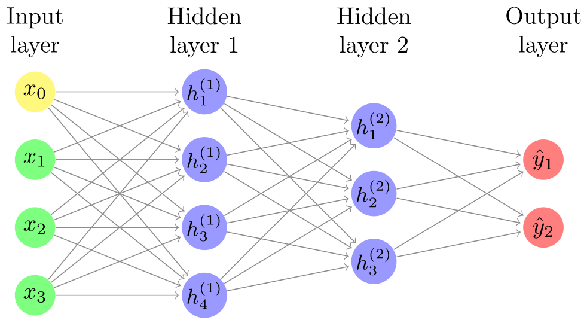
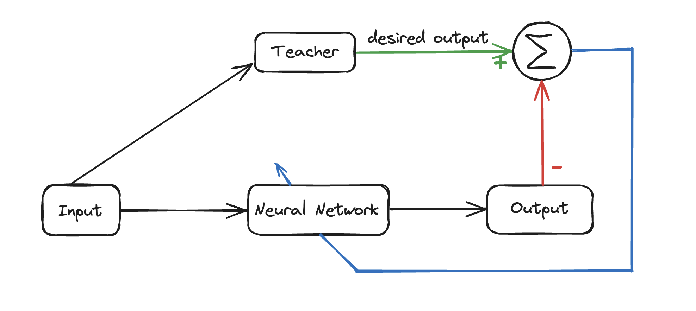

import Latex from "../../components/Latex.astro";

## What is Neural Network ?

_Neural networks_ are inspired by the structure and function of the human brain. They consist of interconnected nodes, like simplified versions of neurons, arranged in layers. These connections are associated with values that influence how the network processes information.

The first layer receives the input data, and the final layer produces the output and between these layers are hidden layers. We give input to the neural network through input layer then it do some [_fancy_ calculations](#maths-behind-the-neural-network) (we will come to that soon) and give us output in output layer.

## How Neural Network Learns?

There are three ways it can learn:

- Supervised Learning
- Unsupervised Learning
- Reinforcement Learning

Here we are going to discuss about Supervised Learning.

**Supervised Learning**: we know that for any neural network it takes N discrete sample points and generated M outputs. These input-output sample pairs are used train the neural network through a form of error correction learning or gradient descent weight adaptation.

Let’s take a example:

Suppose you have an untrained neural network that recognise handwritten digits and you chose supervised learning to train the neural network.

- **Feeding the Network:** Imagine showing the neural network a picture of a handwritten digit, like a 3. This image gets converted into a format the network can understand, like a series of numbers representing brightness levels.
- **Making a Guess:** The network processes the information and makes an initial guess about what digit it's seeing. It might guess a 5 or a 7.
- **Checking the Answer Key:** We have the correct answer (the 3) from the MNIST dataset. We compare the network's guess to the actual digit.
- **Learning from Mistakes:** If the guess was wrong, we calculate the difference between the network's output and the correct answer. This difference tells us how far off the guess was.
- **Fine-Tuning:** Like a student learning from corrections, the network adjusts the connections between its internal processing units (weights) based on the error.

These adjustments are tiny, but over many training examples, they help the network make better guesses in the future.

## Maths behind the Neural Network

Neural networks use a lot of math under the hood, but you don't need to understand all of it to use them effectively. Here's a high-level look:

- **Linear Algebra:** At its core, neural networks perform linear math operations like addition, multiplication, and vector dot products. These operations combine the inputs with weights to arrive at an intermediate value.
- **Activation functions:** These functions introduce non-linearity into the network. They take the intermediate value and transform it into the output. This allows the network to learn complex patterns.
- **Calculus:** Backpropagation, a core training algorithm, relies on calculus to efficiently adjust the weights based on the errors between the network's output and the desired output.

### Forward Propagation

To generate the output it uses Linear Algebra:

<Latex formula="A_{n+1} = \sigma(\overbrace{W^{(n+1)} \cdot A_n}^{\text {weighted\ sum}} +\ \overbrace{b^{(n+1)}}^{\text{bias}})" />

where
$A_{n+1}$ : next layer,

$A_{n}$ : current layer,

$W^{(n+1)}$ : weights connecting $A_{n+1}$ and $A_{n}$,

$b^{(n+1)}$ : baises,

$\sigma(x)$ : activation function (eg: ReLU = $max(0, x)$, $\sigma(x)$ = $\frac{1}{1+e^{-x}}$ etc.)

### Cost Function:

<Latex formula="dZ^{(n)} = A^{(n)} - \overbrace{Y}^{\text{desired output}}" />

### Gradient descent

It is an iterative algorithm commonly used in machine learning to find the minimum of a function. It works by repeatedly adjusting the parameters of the function in the direction that leads the most improvement (like going downhill).

_Analogy_ : Imagine you're lost in a foggy mountain range and want to find the lowest valley. Gradient descent would be like taking small steps downhill each time, eventually reaching the lowest point.

In machine learning, the cost function represents how well a model is performing, and the parameters are the adjustable settings of the model. By following the gradient descent algorithm, the model can adjust its internal settings to improve its performance on a specific task. Gradient descent uses the idea of derivatives from calculus. In simpler terms, a derivative tells you how steep a graph is at a certain point. It uses the information from the derivative to adjust the model's settings and improve its performance.

**PROCESS**: The function $f(\mathbf{w})$ to be minimised. The gradient $\nabla f(\mathbf{w})$ is a vector of partial derivatives indicating the direction of steepest ascent. Parameters are updated as $\mathbf{w} \leftarrow \mathbf{w} - \alpha \nabla f(\mathbf{w})$, where $\alpha$ is the learning rate.

Gradient: $$∇f(w)=(\frac{​∂f}{∂w_1},\frac{​∂f}{∂w_2}​,…,\frac{​∂f}{∂w_n})$$

The process is repeated iteratively until convergence, i.e., until the changes in the function value $f(\mathbf{w})$ become smaller than a pre-defined threshold, or after a fixed number of iterations.

While calculus is involved behind the scenes, you don't necessarily need to understand the complex math to use gradient descent effectively in machine learning tools. Many libraries and frameworks handle the underlying calculations for you.

I hope you understood what is neural network, how it works, and its underlying concepts. If you have any feedback, you can [email me](mailto:yashsharma4583@gmail.com) it will help me improve my content.

Thank you!!
